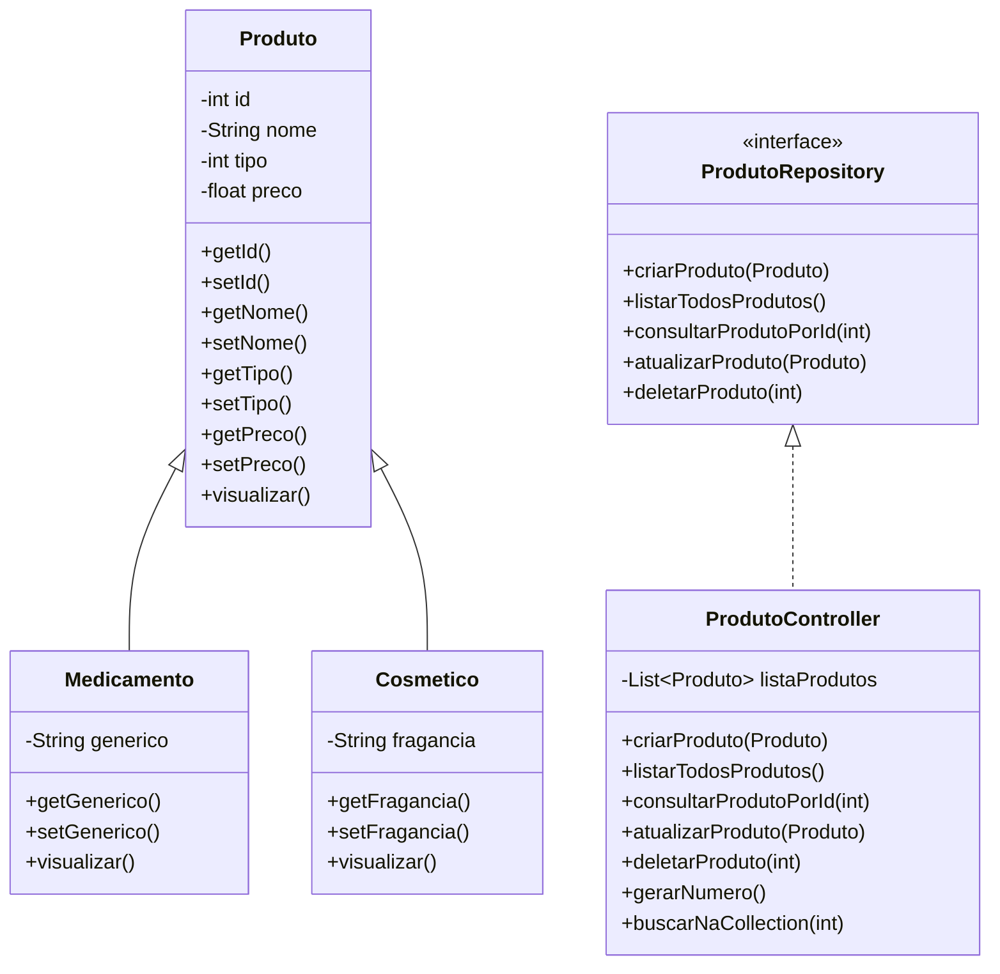

# Sistema CRUD de Produtos - Farmácia


Este é um sistema simples de cadastro e gerenciamento de produtos de uma farmácia. O projeto foi desenvolvido utilizando Java e segue o padrão de arquitetura CRUD (Create, Read, Update, Delete) para os produtos. Ele permite cadastrar, listar, consultar, atualizar e excluir produtos do sistema.

## Tecnologias Utilizadas e Conceitos Aplicados

- **Java 17**
- **Scanner** para input do usuário
- **ArrayList** para armazenar os produtos
- Paradigma de Programação Orientada a Objetos (Herança, Polimorfismo, Abstração e Encapsulamento)
- Interface e implementação (`ProdutoRepository` / `ProdutoController`)


## Funcionalidades

- **Cadastro de Produtos:** Permite cadastrar novos produtos, sendo que cada produto possui um nome, preço e tipo (Medicamento ou Cosmético).
- **Listagem de Produtos:** Exibe todos os produtos cadastrados.
- **Consulta de Produtos por ID:** Permite buscar um produto específico através do seu ID.
- **Atualização de Produtos:** Permite modificar os detalhes de um produto já cadastrado.
- **Exclusão de Produtos:** Permite excluir um produto do sistema após confirmação do usuário.

## Como Rodar o Projeto

### Requisitos

- Java 17 ou superior instalado
- IDE como IntelliJ IDEA ou Eclipse

### Passos

1. Clone este repositório para a sua máquina local:
    ```bash
    git clone https://github.com/usuario/repository.git
    ```

2. Abra o projeto na sua IDE favorita.

3. Compile e execute o projeto.

4. Interaja com o menu no terminal para realizar as operações desejadas.

## Estrutura do Projeto

- **controller:** Contém as classes responsáveis pela lógica de controle do sistema.
- **model:** Contém as classes que representam os produtos (Medicamento, Cosmético e Produto).
- **repository:** Contém a interface de repositório e suas implementações para manipulação de produtos.
- **util:** Contém utilitários como cores para saída no terminal.

```
farmacia/
│
├── model/
│   ├── Produto.java          # Classe abstrata base
│   ├── Medicamento.java      # Subclasse de Produto
│   └── Cosmetico.java        # Subclasse de Produto
│
├── controller/
│   └── ProdutoController.java  # Implementa a interface de repositório
│
├── repository/
│   └── ProdutoRepository.java  # Define operações CRUD
│
├── util/
│   └── Cores.java              # Códigos ANSI para colorir terminal (opcional)
│
└── Menu.java                   # Interface principal com menu interativo
```

## Diagrama UML 


### O diagrama acima mostra:
- Herança: `Medicamento` e `Cosmetico` herdam `Produto`.
- Implementação: `ProdutoController` implementa a interface `ProdutoRepository`.
- Visibilidade dos membros (`-` privado, `+` público).


## Contribuindo

Sinta-se à vontade para contribuir! Se você tiver sugestões, correções ou melhorias, crie um pull request ou abra uma issue.

## Autora

Este projeto foi desenvolvido por Renata Negrini.
> [🌐 LinkedIn](https://www.linkedin.com/in/rmln/) </br>
> [✉️ renatanegrinim@gmail.com](mailto:renatanegrinim@gmail.com)